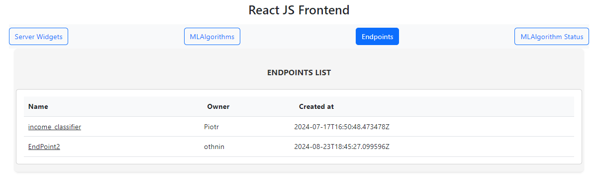

# Django Machine Learning Website

Objectives of the web site:

- ML algorithms deployment automation
- Continuous-integration
- Reproducibility of algorithms and predictions
- Diagnostic and monitoring of algorithms in production
- Scalability
- Users collaboration

Current deployment capabilities:
- Can handle many API endpoints
- Each API endpoint can have several ML algorithms with different versions
- ML code and artifacts (files with ML parameters) are stored in the code repository (git)
- Supports fast deployments and continuous integration (tests for both: server and ML code)
- Supports monitoring and algorithm diagnostic (support A/B tests)
- Is scalable (deployed with containers)
- Has a user interface

## Setup 

- I am using a .env file here backend/server/server/.env. You will need to add one with the following that points to where your code is going to reside on your local server for github integration. Also, in the future more sensitive info will be moved here.
  ```
  ML_ALGS_LOCATION=
  ```

  
## To build/run:

The backend in built on django and uses the Django RestFramework while the frontend is using React. 
  
- You can build using the simple way that I use for dev work. Build the frontend with the npm tools shown in the README files in frontend/. Pretty basic stuff. Start that with `npm start`. On the backend I have a requirements file: docker/backend/requirements.txt. Pip it whatever. Run the backend with `python manage.py runserver` inside backend/server. Note: If your going to run it this way you will probably need to go into the frontend/package.json and change the proxy line to: "proxy": "http://localhost:8000",. The way docker containers communicate and the way this setup is different and I haven't found a way to get both to work yet.

- For production/test you will want to use the Docker containers. Use the docker-compose.yml file it will build both the frontend and backend. Basic commands
1. sudo docker-compose build
2. sudo docker-compose up
Note: Make sure that the frontend/package.json proxy line is: "proxy": "http://wsgiserver:8000" so it can see the backend container.


## General Overview for use:

1. End User builds/trains there ML model in python. Saves encoders, datasets, etc in research/. The python code for the pipeline needs to be saved 
in backend/server/apps/ml/<projectname>. The example we have loaded is income_classifier. Inside there put in your files with the python pipeline code. The compute_predict function is required at this time.

2. SW Engineer will add the code into the load_algorithms.py file. This loads into the registry that holds all the ML Algorithms.

3. Can access the site from either the React front-end or via the API (Django RestFramework). Access the root API, append to URL: /api/v1. 

## Screenshots and Explanations:


This page has a drop down where different widgets that show the status of ther server can be displayed. Unfortunaetly, my server NVIDIA card driver situation has gone awry so the GPU data is lacking. 


Within our income classifier example we have two algorithms that have been loaded into the registry. Click views brings up info on that particular algorithm.



Every project has an endpoint. This example is the income classifier. Clicking on it will bring up the prediction modal.


Here you enter the relevant information that will run the predict on the backend. This goes into the compute_predict that was written earlier.
Example input:
`
{
    "age": 37,
    "workclass": "Private",
    "fnlwgt": 34146,
    "education": "HS-grad",
    "education-num": 9,
    "marital-status": "Married-civ-spouse",
    "occupation": "Craft-repair",
    "relationship": "Husband",
    "race": "White",
    "sex": "Male",
    "capital-gain": 0,
    "capital-loss": 0,
    "hours-per-week": 68,
    "native-country": "United-States"
}
`


Example output.


Shows the status history of the algorithms. Click the Change Algorithm Status button at the bottom to edit


This Modal allows us to change the different attributes for the ML algorithm. When you run the prediction by default it runs the status -> production algorithm. So you can change the algorithm status here.

## TODO:

- [x] Enum the database status values to production, 

- [x] Fix react columns and some formatting looks pretty ugly.

- [] Security Hardening. This site hasn't been reviewed for production deployment on public facing server. It doesn't even have a logon system right now.

- [] Add A/B Testing to the React frontend/

- [] Add Celery to Django for long running jobs

- [x] Ability to pull code from git instead of having it insde the web stack repo. [AddGitHubRepo](READMEGit.md)

- [] Add DVC to the site. This way we can load datasets outside the web stack and do all sorts of intresting stuff. [DVC](https://dvc.org/)


### How to get the endpoints
The endpoint_name is defining the endpoint that we are trying to reach. To view the endpoints that are available go to
app/v1/endpoints. Locate the 'name' line and the value is the endpoint name.

Ex:
http://127.0.0.1:8000/api/v1/income_classifier/predict

You can specifiy alg status or version in URL.
Ex:
http://127.0.0.1:8000/api/v1/income_classifier/predict?status=testing&version=1.1.1


The ABTest keeps information about:

- Which ML algorithms are tested,
- Who and when created the test,
- When test is stopped,
- The test results in the summary field.


The StopABTestView stops the A/B test and compute the accuracy (ratio of correct responses) for each algorithm. The algorithm with higher accurcy is set as production algorithm, the other algorithm is saved with testing status.


## Run tests

please run in backend/server directory

python manage.py test apps.ml.tests
python manage.py test apps.endpoints.tests

Run all tests

python manage.py test apps


### Major Thanks to contact@mljar.com for the base idea and code.
