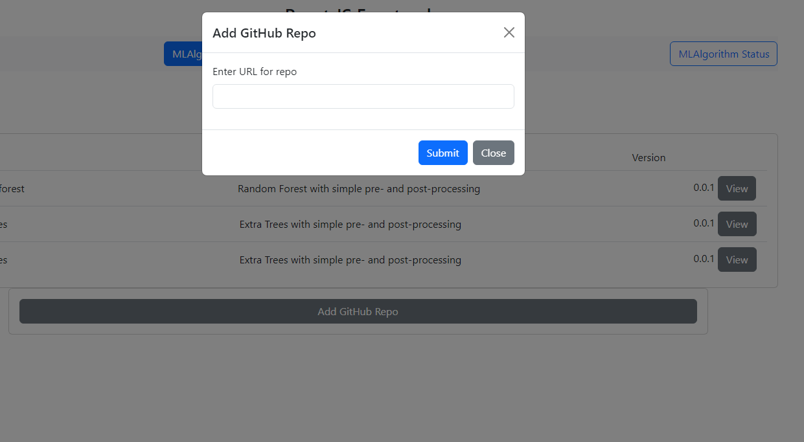
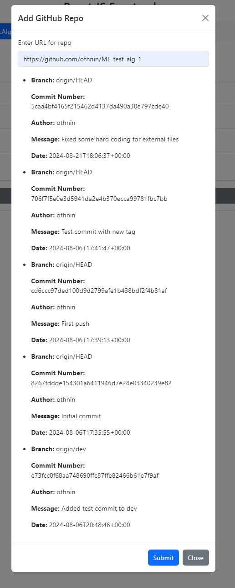
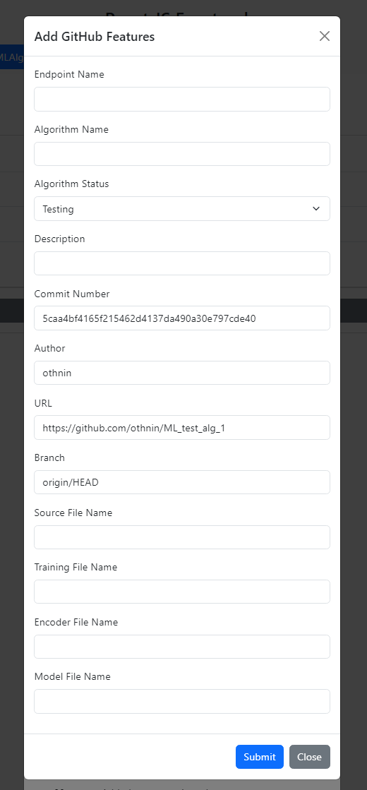
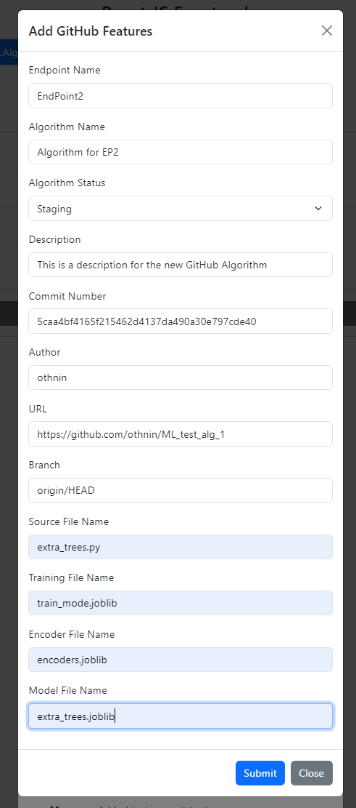
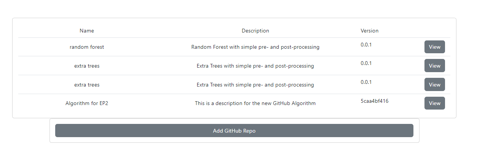

# Information on adding a GitHub Repo to the Website

The lastest update will aloow a user to add a GitHub repo and it's associated code to the Website. Be aware, this code is added and runs natively on the server so it's is relatively easy to add malware, etc. The code has to follow the basic structure that has been laid out in the README file. As and example we are using another [local repo](https://github.com/othnin/ML_test_alg_1)

## The following a run through example:

At the bottom of the MLAlgorithms tab click the Add GitHub Repo button and then put in your URL

It will pull up the repo and search though the commits and present them. Click the one you want to use.

Populate the fields that are required (some are read-only). In this example you can see the info it pulled from the repo and has populated. Currently the models that are unsupported need to have the source file, the training files, an encoder file, and the model file. In the future I would like to make a more robust system.

 

This is populated with all the required information. Currently, it will overwrite and old info in the DB. Will look at giving the user more options.

 

After processing it you should see the repo listed at the bottom and the endpoints populated in the Endpoint tab ready for use.

